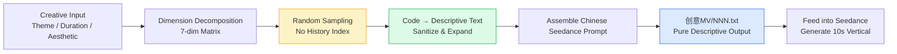

[English](./README.en.md) | [中文](./README.md)

---

<div align="center">

# 🎬 AI Film · Short-Video Prompt Studio

**A prompt workshop for AI video generation models — drop-in 10-second vertical clips.**

> One `NNN.txt` = One shot = One Seedance call.


</div>

---

## ✨ What Is This

A prompt workshop built for **short-video creators, content operators, and AI video players**:

- Break a "creative idea" into **dimensions** — character, costume, action, scene, camera, dialogue, aesthetic.
- **Sample once** from each asset pool to assemble every element of a 10-second vertical clip.
- Expand every sampled internal code into **pure descriptive text**, output as a self-contained prompt that feeds Seedance directly.

Variety doesn't come from historical memory — it comes from the **dimension matrix + random sampling**. Every output feels fresh, yet stays coherent.

---

## 🚀 Why Use It

| Feature | What it does |
|---|---|
| 🎯 **Drop-in ready** | One file, one shot, one prompt — no internal codes leak out. |
| 🎲 **Sampling-driven** | Character × Costume × Action × Scene × Camera × Dialogue × Aesthetic — a 7-dim matrix sampled at random. |
| 🧼 **Clean output interface** | Zero internal codes — websites, NLE software, and human directors can consume the result directly. |
| 🌏 **Chinese-first** | Native Chinese Seedance structure by default; one-click switch to English h3 three-section style. |
| 🧱 **Hard realism constraints** | No flashy gimmicks — protected by long-term hard rules in `指令/约束.md`. |
| ⚙️ **Flexible aesthetic** | Decided jointly by user / scheduler / AI — no locked-in default style. |
| 🎬 **Short-drama mode** | Multi-shot coherent micro-dramas (fingerprint + beat + transition) — see `短剧/`. |

> [!TIP]
> **Who is this for?** Creators who want to use AI for short videos but struggle with "writing professional prompts" or "every clip looking the same."

---

## ⚡ Quick Start (3 Steps)

```bash
# 1. Clone the repository
git clone https://github.com/SoftMeng/ai-film.git && cd ai-film

# 2. Read the master instruction
cat 指令/主指令.md

# 3. Generate a 10-second vertical clip prompt
#    Feed the workshop with "theme / duration / aesthetic"; output lands in 创意MV/NNN.txt
```

> [!NOTE]
> New to AI prompt workshops? Read the [Features](#-why-use-it) section to understand the 7-dim matrix first — you'll onboard much faster.

---

## 🎬 Example: A 10-Second Vertical Clip

> The example below is **fully sanitized** — every element is descriptive text, ready to paste into Seedance.

**Theme**: Urban night / warm lights / mid-tempo motion
**Duration**: 10 seconds · vertical 9:16

```text
【整体风格】
电影感都市夜景，写实质感，避免霓虹赛博朋克风格。
中速律动 BPM 100-120，镜头整体节奏感稳定。

【镜头 1】（0-3 秒）
中近景，主体在画面中央偏下。
镜头轻微推进，速度均匀。
夜景街道湿漉漉的地面反光，路灯与店铺招牌的暖色光在地面拉出长条形光斑。

【演员本体】
亚洲女性，约 25 岁，短发齐耳，妆容淡雅。
穿米白色丝质衬衫，袖口挽到小臂中部；下身深色高腰西裤，垂感面料。
表情冷静略带疏离，视线望向画面外侧约 45 度。

【演员动作】
身体中段有节律地随律动左右摆动，幅度不大。
双手自然垂在身体两侧，随摆动轻微跟动。
重心稳定落在双脚之间，膝盖微屈。

【运镜节奏】
中速推进 + 微晃，营造手持稳定器的电影感。
律动点与镜头推进节拍错开半拍，形成轻微对峙感。
```

> [!WARNING]
> **Forbidden content**: internal IDs (e.g. `No0008`), camera-template codes (e.g. `Template 2`), internal beat names (e.g. "Jiatong swing"), atomic-action codes (e.g. "hip figure-eight"), file paths.
> All of these **must be expanded into descriptive text** at write time.

---

## 🧠 Workflow: Dimension Matrix + Random Sampling



**Core principles**:

1. **Decompose**: Split "make a 10-second video" into 7 orthogonal dimensions.
2. **Sample**: Draw one item at random from each dimension's asset pool — no history remembered.
3. **Sanitize**: Sampled results are internal codes; expand them all into plain descriptive text at write time.
4. **Assemble**: Combine into the Seedance Chinese skeleton (overall style + shot + actor + action + camera rhythm).

> [!NOTE]
> Variety doesn't come from "comparing history" — it comes from "dimension matrix + random" — avoiding "the more you add, the more you break."

---

## 🧩 The 7-Dimension Matrix

| Dimension | Role | Focus |
|---|---|---|
| 👤 Character | Subject identity, age, temperament | Physical traits + inner personality |
| 👗 Costume | Color + material + silhouette | No internal names exposed |
| 🏙️ Scene | Physical location | No people / no lighting / no camera |
| 💃 Action | Body language & rhythm | Atomic action cards |
| 🎥 Camera | Movement rhythm & transitions | Templates + movement lexicon |
| 💬 Dialogue | Optional speech / subtitles | Flirt phrases + inspiration seeds |
| 🎨 Aesthetic | Overall visual style (optional) | No locked-in default |

<details>
<summary>📖 <b>Why 7 dimensions, not more?</b></summary>

> More dimensions turn this into a "checklist." 7 is the sweet spot — enough orthogonal combinations to generate millions of unique clips, without turning sampling into "dimension stuffing."
>
> Variety comes from **orthogonal dimensions + randomness**, not from "adding one more dimension."

</details>

---

## 🛣️ Roadmap

- [x] 7-dim matrix + random sampling skeleton
- [x] Chinese Seedance prompt structure (default)
- [x] Clean output interface (zero internal codes)
- [ ] English h3 three-section template switch
- [ ] Cross-platform adapters (Kling / Veo / Sora)
- [ ] Web-based visual sampler
- [ ] Multi-user collaborative asset pool

---

## 📜 License

Released under the **MIT License**.

You are free to use, modify, and redistribute the prompt-engineering structure and examples in this repository, provided the copyright notice is retained.

> The concrete content of each asset pool (characters, costumes, scenes, actions, dialogue, etc.) is intended for study and derivative creation — please respect the original authors.

---

## 🙏 Acknowledgements

- **Seedance / 即梦** — for making 10-second vertical video generation a daily tool.
- **GitHub Flavored Markdown** — the README itself is a product landing page.
- **Everyone who uses AI to write videos** — you're turning "prompt engineering" into a craft.

## 📮 Feedback & Contributing

- 🐛 **Report a bug**: [`.github/ISSUE_TEMPLATE/bug-report.md`](.github/ISSUE_TEMPLATE/bug-report.md)
- 💡 **Request a feature / creative**: [`.github/ISSUE_TEMPLATE/feature-request.md`](.github/ISSUE_TEMPLATE/feature-request.md)

---

<div align="center">

**If this project helps you, a ⭐ Star is always appreciated!**

<sub>Made with ❤️ for AI video creators</sub>

</div>