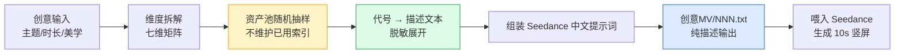

[English](./README.en.md) | [中文](./README.md)

---

<div align="center">

# 🎬 AI Film · 短视频提示词工作台

**为 AI 视频生成模型，编写可一键喂入的 10 秒竖屏片段提示词。**

> 一个 NNN.txt = 一个单镜头 = 一次 Seedance 调用。


</div>

---

## ✨ 这是什么

一个面向**短视频创作者 / 内容运营 / AI 视频玩家**的提示词工作台：

- 把"创意"拆成"维度"——人设、装扮、动作、场景、镜头、对白、风格。
- 从资产池里**随机抽样**一次，组合出一个 10 秒竖屏片段的全部要素。
- 把抽到的内部代号**展开成描述性中文**，输出成可直接喂给 Seedance 的纯文本。

多样化不靠历史记忆，靠**维度矩阵 + 随机**——所以每个片段都有惊喜感，又不至于失控。

---

## 🚀 为什么用它

| 特性 | 说明 |
|---|---|
| 🎯 **一拍即用** | 单文件、单镜头、单提示词；不依赖工程内部任何代号。 |
| 🎲 **抽样驱动** | 人设 × 装扮 × 动作 × 场景 × 镜头 × 对白 × 美学 七维矩阵随机组合。 |
| 🧼 **接口纯净** | 产物零内部代号——网站 / 编辑软件 / 真人导演拿到就能消费。 |
| 🌏 **中文优先** | 默认中文 Seedance 结构，跨平台可一键切英文 h3 三段式。 |
| 🧱 **真实感硬约束** | 不堆砌炫技词汇，受 `指令/约束.md` 长期红线保护。 |
| ⚙️ **风格灵活** | 由用户/调度层/AI 共同决定画风，不锁定默认美学。 |
| 🎬 **短剧模式** | 多镜头连贯微短剧——形象指纹 + 情绪节拍 + 镜头切换（详见 `短剧/`）。 |

> [!TIP]
> **适合谁？** 想用 AI 生成短视频，但苦于"提示词写不专业 / 每次都差不多" 的创作者。

---

## ⚡ 快速上手（3 步）

```bash
# 1. 克隆仓库
git clone https://github.com/<your-org>/ai-film.git && cd ai-film

# 2. 阅读主指令
cat 指令/主指令.md

# 3. 生成一个 10 秒竖屏片段提示词
#    把"主题/时长/美学风格"喂给工作台，输出到 创意MV/NNN.txt
```

> [!NOTE]
> 不熟悉 AI 提示词工作台？先看下方 [Features](#-为什么用它) 理解七维矩阵，再上手会快很多。

---

## 🎬 示例：10 秒竖屏片段

> 以下示例**完全脱敏**——所有元素都是描述性中文，可直接粘贴到 Seedance。

**主题**：都市夜景 / 霓虹情绪 / 中速律动
**时长**：10 秒 · 竖屏 9:16

```text
【整体风格】
电影感都市夜景，写实质感，避免霓虹赛博朋克风格。
中速律动 BPM 100-120，镜头整体节奏感稳定。

【镜头 1】（0-3 秒）
中近景，主体在画面中央偏下。
镜头轻微推进，速度均匀。
夜景街道湿漉漉的地面反光，路灯与店铺招牌的暖色光在地面拉出长条形光斑。

【演员本体】
亚洲女性，约 25 岁，短发齐耳，妆容淡雅。
穿米白色丝质衬衫，袖口挽到小臂中部；下身深色高腰西裤，垂感面料。
表情冷静略带疏离，视线望向画面外侧约 45 度。

【演员动作】
身体中段有节律地随律动左右摆动，幅度不大。
双手自然垂在身体两侧，随摆动轻微跟动。
重心稳定落在双脚之间，膝盖微屈。

【运镜节奏】
中速推进 + 微晃，营造手持稳定器的电影感。
律动点与镜头推进节拍错开半拍，形成轻微对峙感。
```

> [!WARNING]
> **禁止出现的内容**：内部编号（如 `No0008`）、镜头模板代号（如 `模板 2`）、节奏组合名（如"嘉桐摇"）、原子动作代号（如"胯画八"）、文件路径。
> 所有这些都必须在写作时**展开为描述性文本**。

---

## 🧠 工作流：维度矩阵 + 随机抽样



**核心思想**：

1. **拆维**：把"做一个 10 秒视频"拆成 7 个正交维度。
2. **抽样**：每次从各维度的资产池中随机抽取一个，不记忆历史。
3. **脱敏**：抽样结果是内部代号，写作时全部展开为描述性文本。
4. **组装**：按 Seedance 中文骨架（运镜 + 演员 + 动作 + 节奏）拼装。

> [!NOTE]
> 多样性不靠"比对历史"，靠"维度矩阵 + 随机"——避免"加得越多错的越多"。

---

## 🧩 七维矩阵速览

| 维度 | 作用 | 关注点 |
|---|---|---|
| 👤 人设 | 主体形象、年龄、气质 | 物理生理特征 + 内在性格 |
| 👗 装扮 | 颜色 + 材质 + 形制 | 不暴露内部名 |
| 🏙️ 场景 | 物理地点 | 无人物 / 无灯光 / 无镜头 |
| 💃 动作 | 身体语言与节律 | 动作原子卡 |
| 🎥 镜头 | 运镜节奏与切换 | 镜头模板 + 运动词典 |
| 💬 对白 | 可选的语言 / 字幕 | 调情句式 + 灵感方向 |
| 🎨 美学 | 整体画风（可选） | 不锁定默认美学 |

<details>
<summary>📖 <b>为什么是 7 维，不是更多？</b></summary>

> 维度越多越像在写"检查清单"。7 维是经验值——足够组合出千万级片段，又不至于让抽样变成"维度堆砌"。
>
> 多样性靠**维度正交 + 随机**，不靠"再加一个维度"。

</details>

---

## 🛣️ Roadmap

- [x] 七维矩阵 + 随机抽样骨架
- [x] Seedance 中文提示词结构（默认）
- [x] 产物对外接口纯净（零内部代号）
- [ ] 英文 h3 三段式模板切换
- [ ] 跨平台适配（Kling / Veo / Sora）
- [ ] Web 可视化抽样器
- [ ] 多人协作资产库

---

## 📜 License

本仓库采用 **MIT License** 发布。

你可以在保留版权声明的前提下自由使用、修改、分发本仓库的提示词工程结构与示例。

> 资产池（人设、装扮、场景、动作、对白等）的具体内容仅供学习与二次创作使用，请尊重原作者。

---

## 🙏 致谢

- **Seedance / 即梦**——让 10 秒竖屏视频生成成为日常工具。
- **GitHub Flavored Markdown**——README 本身就是产品落地页。
- **所有用 AI 写视频的人**——你们让"提示词工程"成为一门手艺。

## 📮 反馈与贡献

- 🐛 **提 Bug**：[`.github/ISSUE_TEMPLATE/bug-report.md`](.github/ISSUE_TEMPLATE/bug-report.md)
- 💡 **提功能 / 创意需求**：[`.github/ISSUE_TEMPLATE/feature-request.md`](.github/ISSUE_TEMPLATE/feature-request.md)

---

<div align="center">

**如果这个项目对你有帮助，欢迎 ⭐ Star 支持！**

<sub>Made with ❤️ for AI video creators</sub>

</div>